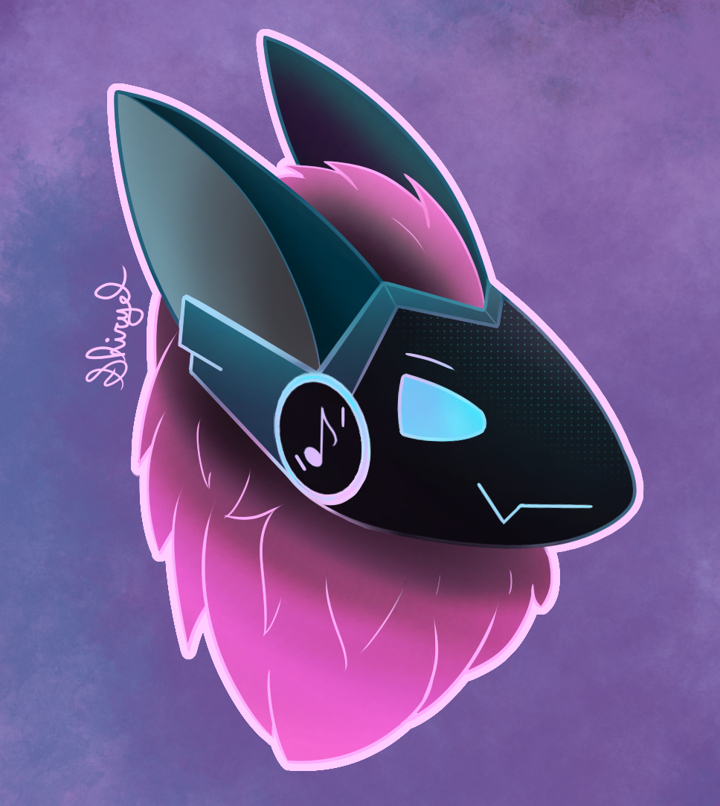

# 𝘙𝘺𝘶𝘴𝘩
[](https://twitter.com/shiryel_)

Ryush is a discord bot under construction



## How to test

With elixir and the phoenix framework installed:
```
export BOT_TOKEN="you discord bot_token here"

# start postgres container
podman run -d -e POSTGRES_PASSWORD=postgres -p 5432:5432 postgres

mix deps.get
mix ecto.setup
mix phx.server
```

Now you can test your bot on your discord and visit [`localhost:4000/dashboard`](http://localhost:4000/dashboard) to see the bot dashboard

## Docs

You can generate the docs with `mix docs` and then access the index from your browser

## License

`Under definition, in the moment just dont use this bot without giving the credits`
