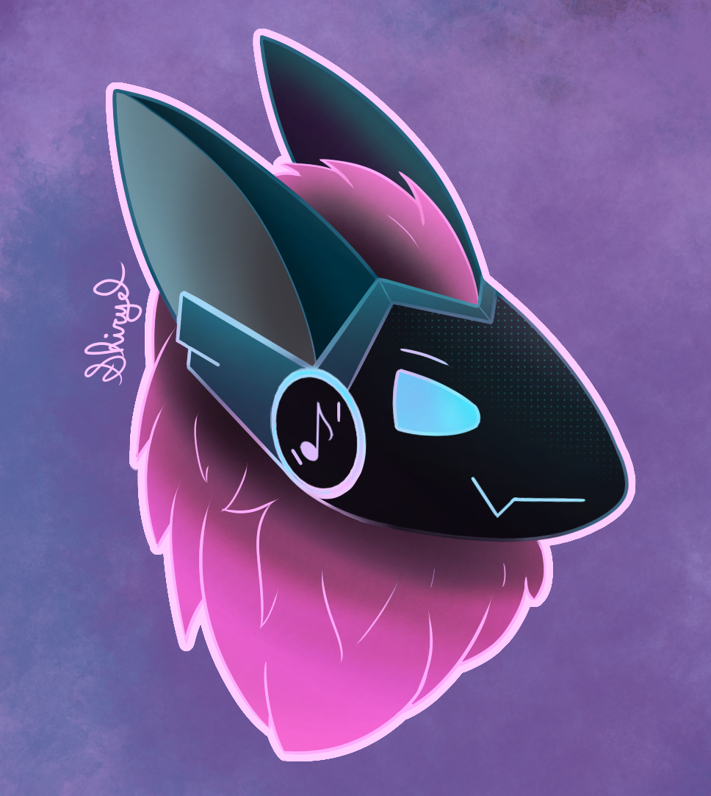

# 𝘙𝘺𝘶𝘴𝘩
[](https://twitter.com/shiryel_)

Ryush is a discord bot under construction



## How to use

### ⚡ [Fist click here to invite the bot to your server](https://discord.com/api/oauth2/authorize?client_id=764685221756796959&permissions=26688&scope=bot)

The permissions that he needs:
- Send Messages
- Manage Messages
- Embed Links
- Add Reactions

Then you can use `!help` or `@Ryush help` to see the comands

**To change the prefix use `!change_prefix` or `@change_prefix`**

The permissions for each `managed command` can be configured by a administrator

## Code structure

For making this bot scalable, its used a **BUNCH** of dynamic supervisioned processes (powered by erlang 😝), it works, but needs caution when changing stuff, mainly because its use a Mnesia DB to keep the process state per node!

So, you probably is wandering what is the flux, well... its like that:

### Discord

``` 
API --> WebSocket --> Guild --> GuildTalk[command] --> Connection
                        |             |--> GuildFlow[command] --> Connection
                        v                       |--> GuildEmojer 
                    GuildEmojer
```

- `API` is the discord API
- `WebSocket` is the discord bot websocket connection
- `Guild` is a `GenServer` that keeps a guild state
- `GuildTalk` is a `GenServer` that keeps a talk with a user on a channel
- `GuildFlow` is a `GenServer` that keeps a command running on a channel
- `GuildEmojer` is a `GenServer` that handles puting emojis on the bot messages

## Docs

You can generate the docs with `mix docs` and then access the index.html from your browser!

## How to test

If you want to add new feature for your friends, you can change the code and then with elixir and the phoenix framework installed you can run:
```
export BOT_TOKEN="you discord bot_token here"

# start postgres container
podman run -d -e POSTGRES_PASSWORD=postgres -p 5432:5432 postgres

mix deps.get
mix ecto.setup
mix phx.server
```

Now you can test your bot on your discord and visit [`localhost:4000/dashboard`](http://localhost:4000/dashboard) to see the bot dashboard

# Legal Stuff

## Software License

Give credit where credit is due. If you wish to use my code in a project, please credit me. 
Just don't blatantly copy it or refrain from crediting.

    Ryush, a bot for doing fun stuff
    Copyright (C) 2020 Shiryel

    This program is free software: you can redistribute it and/or modify
    it under the terms of the GNU Affero General Public License as published
    by the Free Software Foundation, either version 3 of the License, or
    (at your option) any later version.

    This program is distributed in the hope that it will be useful,
    but WITHOUT ANY WARRANTY; without even the implied warranty of
    MERCHANTABILITY or FITNESS FOR A PARTICULAR PURPOSE. See the
    GNU Affero General Public License for more details.

    You should have received a copy of the GNU Affero General Public License
    along with this program. If not, see <https://www.gnu.org/licenses/>.

[The full license can be found here](https://github.com/shiryel/ryush-bot/blob/master/LICENSE)

## Artwork License

The artwork for this project (more specificaly the Ryush profile picture) is licensed under 

    Attribution-NonCommercial-NoDerivatives 4.0 International (CC BY-NC-ND 4.0)
    Copyright (C) 2020 Shiryel
